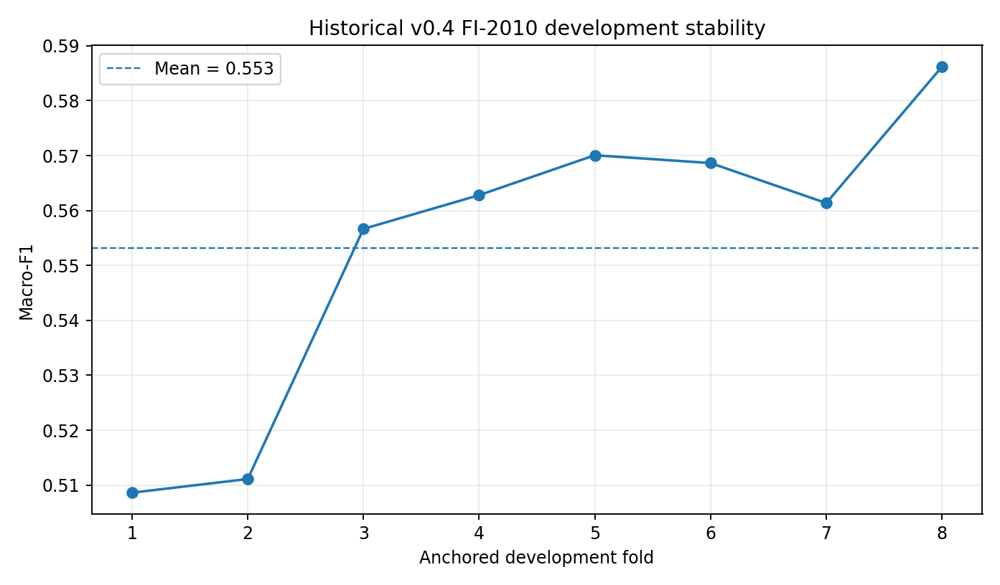
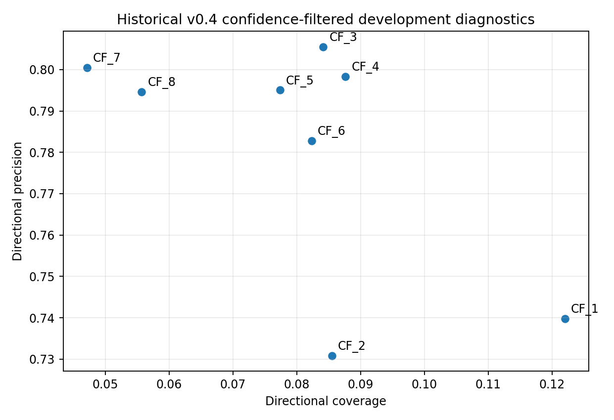

# FI-2010 results

This directory is replaced automatically by `fi2010-publish` after an integrity-validated final
release.

Until that release is performed, the repository retains only the historical v0.4 development
benchmark: mean macro-F1 **0.553**, worst fold **0.509**, and confidence-filtered directional
precision **78.1%** at **8.0%** coverage across CF_1-CF_8. Those values are development diagnostics,
not a final CF_9 result.

## Historical development visualisation

These figures are explicitly historical development diagnostics and are replaced by v0.6 generated
evidence after the real rerun/final release.
