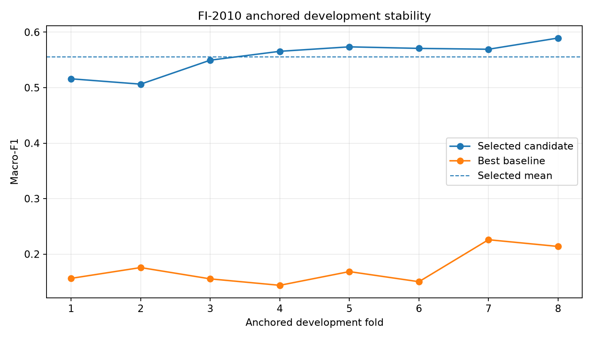
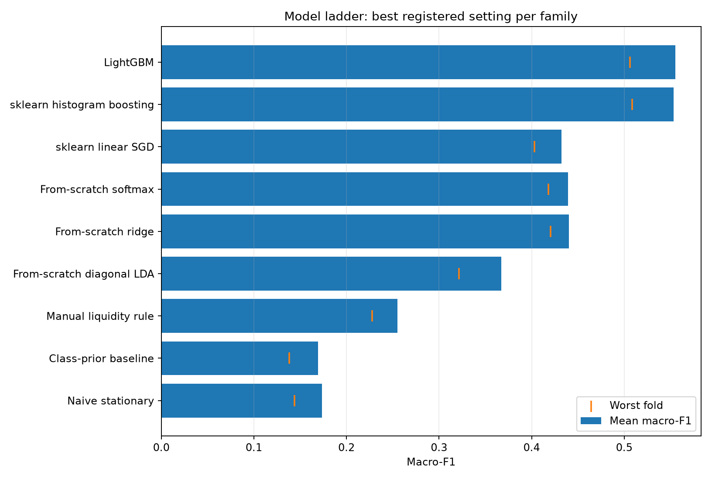
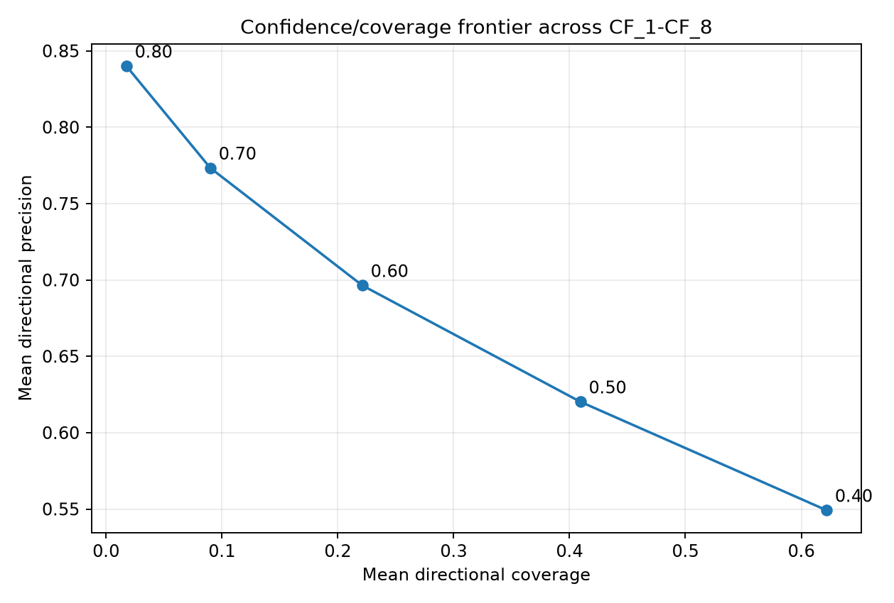
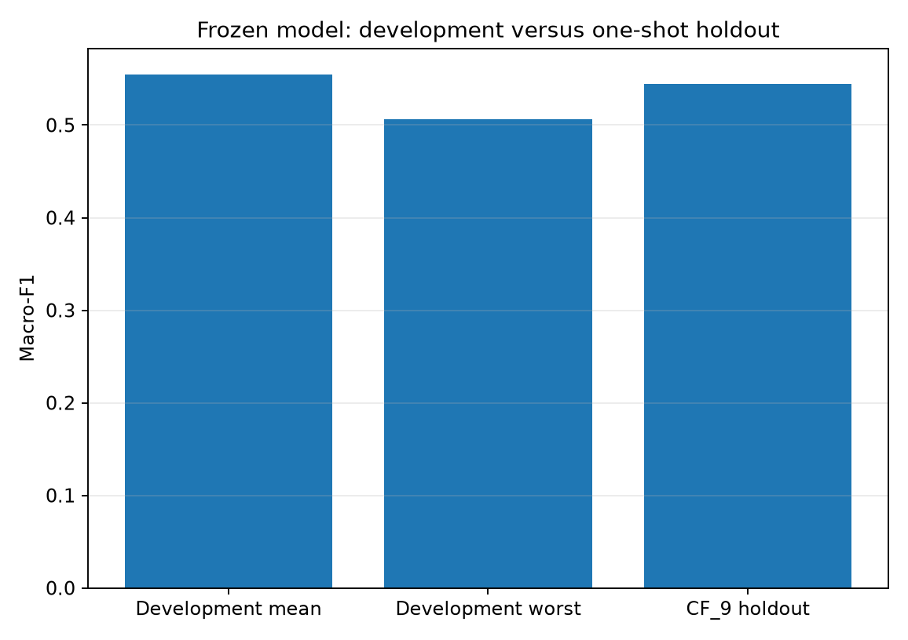

# FI-2010 anchored walk-forward evidence

Evidence status: **registered real one-shot holdout evidence**.

This study evaluates predictive classification and confidence-filtered directional signals only. FI-2010's normalized, anonymised snapshots do not support a defensible executable-performance reconstruction.

## Executive summary

- Selected model: **LightGBM lr=0.08, leaves=15**.
- Development mean macro-F1: **0.555040** across eight anchored CF pairs; worst fold: **0.506312**.
- Fold-to-fold macro-F1 standard deviation: **0.027427**.
- Best-baseline uplift in mean macro-F1: **0.381403**.
- Selected confidence rule: threshold **0.70**, mean directional precision **77.3%** at **9.0%** coverage.
- One-shot CF_9 holdout macro-F1: **0.544605**.
- One-shot CF_9 directional precision: **75.8%** at **6.0%** coverage.
- Holdout minus development-mean macro-F1: **-0.010435**.

## Registered protocol

- Representation: `NoAuction/1.NoAuction_Zscore`; feature rows 1-144.
- Publisher classes: `1=up`, `2=stationary`, `3=down`.
- Primary target: label row 4, five sampled steps / 50 underlying events.
- Development: matching Train/Test members for CF_1-CF_8, handled independently.
- Cumulative training members were never concatenated.
- Selection: mean macro-F1, then worst-fold macro-F1, then lower complexity.
- Candidate and confidence-threshold tuning use development folds only.

## Selected development candidate

Specification: `{"complexity":8,"learning_rate":0.08,"model":"lightgbm_multiclass","n_estimators":180,"num_leaves":15}`  
Mean macro-F1: 0.555040  
Worst-fold macro-F1: 0.506312  
Confidence threshold: 0.700000

## Fold stability

| Fold | Macro-F1 | Balanced accuracy | Log loss | MCC | Fit seconds | Pred. obs/s |
|---:|---:|---:|---:|---:|---:|---:|
| 1 | 0.515962 | 0.521891 | 0.960815 | 0.294890 | 1.287726 | 484097.906408 |
| 2 | 0.506312 | 0.515161 | 0.979638 | 0.278297 | 2.316996 | 479774.967351 |
| 3 | 0.549518 | 0.549994 | 0.928682 | 0.325800 | 2.869342 | 431418.520136 |
| 4 | 0.565502 | 0.568065 | 0.918443 | 0.348692 | 5.688273 | 272447.658479 |
| 5 | 0.573565 | 0.574197 | 0.905182 | 0.362428 | 4.653554 | 389466.731377 |
| 6 | 0.570779 | 0.575119 | 0.905535 | 0.357956 | 7.092615 | 322713.050160 |
| 7 | 0.569220 | 0.572353 | 0.883049 | 0.371087 | 8.589692 | 363480.549985 |
| 8 | 0.589459 | 0.584902 | 0.856164 | 0.409975 | 7.876567 | 413279.900240 |

## Model comparison

| Rank | Model | Mean macro-F1 | Worst-fold macro-F1 |
|---:|---|---:|---:|
| 1 | LightGBM lr=0.08, leaves=15 | 0.555040 | 0.506312 |
| 2 | LightGBM lr=0.05, leaves=31 | 0.554713 | 0.504631 |
| 3 | LightGBM lr=0.08, leaves=31 | 0.554389 | 0.495130 |
| 4 | LightGBM lr=0.05, leaves=15 | 0.554327 | 0.513775 |
| 5 | LightGBM lr=0.03, leaves=63 | 0.554182 | 0.501361 |
| 6 | LightGBM lr=0.03, leaves=31 | 0.554135 | 0.512322 |
| 7 | LightGBM lr=0.05, leaves=63 | 0.553565 | 0.494647 |
| 8 | HistGradientBoosting lr=0.08, leaves=31 | 0.553178 | 0.508623 |
| 9 | LightGBM lr=0.03, leaves=15 | 0.551389 | 0.522384 |
| 10 | LightGBM lr=0.08, leaves=63 | 0.550377 | 0.487690 |
| 11 | NumPy ridge alpha=0.1 | 0.440398 | 0.420653 |
| 12 | NumPy ridge alpha=1.0 | 0.440390 | 0.420611 |
| 13 | NumPy ridge alpha=10.0 | 0.440378 | 0.420536 |
| 14 | NumPy softmax regression | 0.439190 | 0.418211 |
| 15 | SGD log-loss alpha=0.001 | 0.432185 | 0.403201 |
| 16 | SGD log-loss alpha=0.0001 | 0.395471 | 0.359685 |
| 17 | NumPy diagonal LDA shrinkage=0.1 | 0.367096 | 0.321663 |
| 18 | Manual liquidity-pressure rule | 0.255151 | 0.227884 |
| 19 | Always stationary | 0.173637 | 0.143674 |
| 20 | Class-prior baseline | 0.169535 | 0.138395 |

### Interpretable-to-nonlinear model ladder

The comparison deliberately starts with a fixed microstructure rule and from-scratch statistical models before library tree ensembles. This makes the incremental value of model complexity observable on the same anchored folds.

| Family | Best registered specification | Mean macro-F1 | Worst fold |
|---|---|---:|---:|
| Naive stationary | Always stationary | 0.173637 | 0.143674 |
| Class-prior baseline | Class-prior baseline | 0.169535 | 0.138395 |
| Manual liquidity rule | Manual liquidity-pressure rule | 0.255151 | 0.227884 |
| From-scratch diagonal LDA | NumPy diagonal LDA shrinkage=0.1 | 0.367096 | 0.321663 |
| From-scratch ridge | NumPy ridge alpha=0.1 | 0.440398 | 0.420653 |
| From-scratch softmax | NumPy softmax regression | 0.439190 | 0.418211 |
| sklearn linear SGD | SGD log-loss alpha=0.001 | 0.432185 | 0.403201 |
| sklearn histogram boosting | HistGradientBoosting lr=0.08, leaves=31 | 0.553178 | 0.508623 |
| LightGBM | LightGBM lr=0.08, leaves=15 | 0.555040 | 0.506312 |

Best from-scratch/manual candidate: **NumPy ridge alpha=0.1** at **0.440398** mean macro-F1.
Best nonlinear tree candidate: **LightGBM lr=0.08, leaves=15** at **0.555040** mean macro-F1.
Nonlinear-minus-best-manual development macro-F1 difference: **0.114641**. This is a development-only complexity comparison, not a holdout-tuned result.

## Selected-candidate class diagnostics

| Class | Mean precision | Mean recall | Mean F1 | Total support |
|---|---:|---:|---:|---:|
| up | 0.546508 | 0.530658 | 0.536522 | 102756 |
| stationary | 0.614437 | 0.575014 | 0.583098 | 119905 |
| down | 0.532612 | 0.567458 | 0.545499 | 100227 |

Aggregate CF_1-CF_8 confusion matrix (rows=true, columns=predicted):

| True / Pred. | Up | Stationary | Down |
|---|---:|---:|---:|
| Up | 54394 | 21616 | 26746 |
| Stationary | 21725 | 74467 | 23713 |
| Down | 23563 | 20143 | 56521 |

## Confidence/coverage frontier

| Threshold | Mean precision | Worst-fold precision | Mean coverage | Mean abstention |
|---:|---:|---:|---:|---:|
| 0.40 | 0.549196 | 0.490870 | 0.621777 | 0.378223 |
| 0.50 | 0.620229 | 0.562500 | 0.409317 | 0.590683 |
| 0.60 | 0.696403 | 0.637988 | 0.221132 | 0.778868 |
| 0.70 **selected** | 0.773337 | 0.725890 | 0.089950 | 0.910050 |
| 0.80 | 0.840051 | 0.789179 | 0.017538 | 0.982462 |

## Final holdout

The source-side seal and completion anchor validated successfully. This is the single retained final evaluation; the release gate does not permit a rerun.

- Macro-F1: 0.544605
- Balanced accuracy: 0.545991
- Multiclass log loss: 0.923372
- MCC: 0.339164
- Directional precision at the frozen threshold: 0.758477
- Directional coverage: 0.060024

## Reproducibility and integrity

- Runtime versions: `{"joblib": "1.5.3", "lightgbm": "4.7.0", "numpy": "2.5.2", "python": "3.13.5", "scikit_learn": "1.9.0"}`.
- Development implementation hashes: `{"fi2010_config.py": "3744684984cbf4351bd75c2e0025fa1924fbbbdf5a22ecd4e772c1766ca31d38", "fi2010_data.py": "6981d4dfbf9d748d5dc9bfe1d8147e5b0b13a35ac141b35cb72f5f41bed111ad", "fi2010_models.py": "46d9cfac0aea8919c6969499b16bc518eb3da4769d64eb2cf5bb7e8bc53645fe", "fi2010_reporting.py": "84ad5b114b7401800c3349f6e926a3a9ff94d3c473501725f5900be54b2defbf", "fi2010_study.py": "6b308ab5aebd43c5f2a2692569257007f61d475ad9ca9ed05ad2fdf369a652d0"}`.
- Final Train_CF_9 refit observations: 362400.
- Raw data, extracted payloads and model binaries remain gitignored; evidence artifacts are content-addressed.

## Limitations

FI-2010 omits unnormalised prices, timestamps, instrument identities, venue/feed details and reliable instrument/day boundaries. The study consumes publisher-provided Z-score matrices and cannot independently audit the original normalization field of view. Snapshot classification is therefore the supported design; sequence windows and executable trading claims are excluded.
